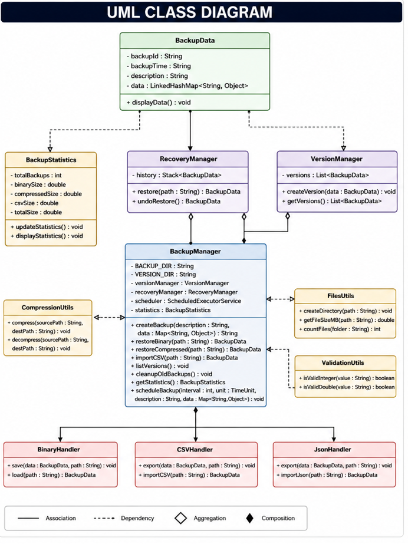
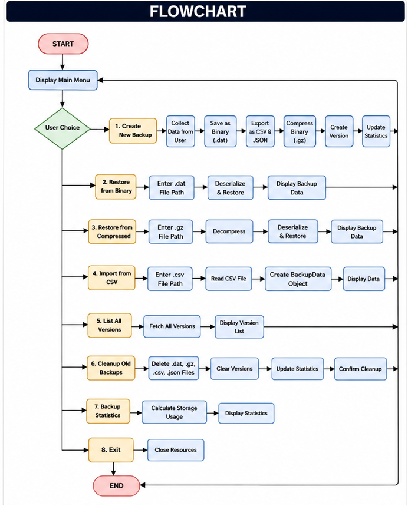
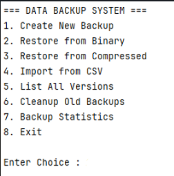
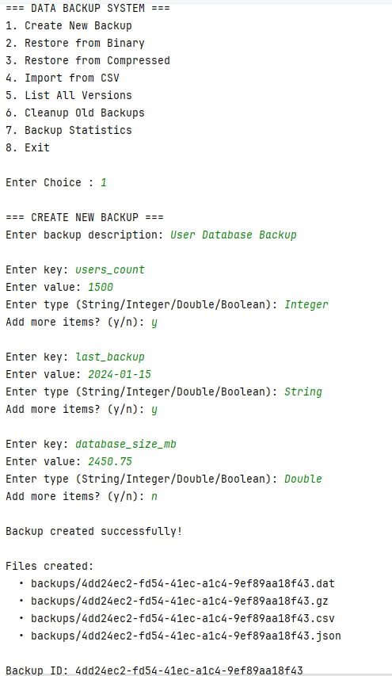
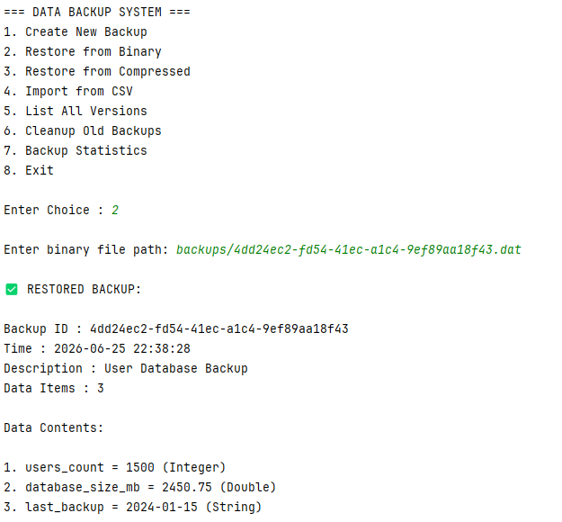
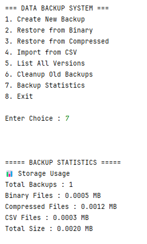

# Data Backup System

## Project Overview

Data Backup System is a Java-based console application developed using Core Java, Maven, Serialization, Collections Framework, File Handling, GZIP Compression, JSON Processing, and CSV Processing.

The application allows users to create, compress, restore, version, and manage backups efficiently while maintaining backup history and statistics.

---

# Features

## Backup Management

* Create New Backup
* Binary Backup (.dat)
* Compressed Backup (.gz)
* CSV Export
* JSON Export

## Restore Operations

* Restore from Binary Backup
* Restore from Compressed Backup
* Import from CSV
* Restore from JSON

## Version Control

* Automatic Version Creation
* List All Backup Versions
* Undo Restore Operation

## Statistics

* Total Backups
* Binary File Size
* Compressed File Size
* CSV File Size
* Total Storage Usage

## Utility Features

* Scheduled Backup Support
* Cleanup Old Backups
* Validation Utilities

---

# Technologies Used

* Java 21
* Maven
* Gson 2.10.1
* Java Serialization
* Collections Framework
* GZIP Compression
* CSV Processing
* JSON Processing
* ScheduledExecutorService

---

# Project Structure

```text
src/main/java/com/backup

├── compression
│   └── CompressionUtils.java

├── io
│   ├── BinaryHandler.java
│   ├── CSVHandler.java
│   └── JsonHandler.java

├── main
│   └── DataBackupSystem.java

├── model
│   ├── BackupData.java
│   └── BackupStatistics.java

├── service
│   ├── BackupManager.java
│   ├── RecoveryManager.java
│   └── VersionManager.java

├── utils
│   ├── FilesUtils.java
│   └── ValidationUtils.java
```

---

# UML Diagram



---

# Flowchart



---

# Screenshots

## Main Menu



## Create Backup



## Restore Backup



## Statistics



---

# Future Improvements

* AES Encryption Support
* Cloud Backup Integration
* Database Backup Support
* GUI Interface using JavaFX
* REST API Support

---

# Author

Amrit Chandan Mishra

Java Developer | Core Java | Collections Framework | SQL
